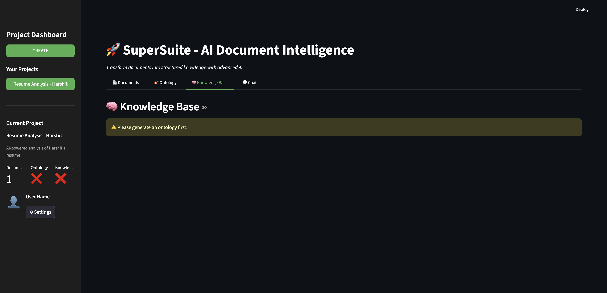

# Exploring Knowledge

Learn how to extract and explore the knowledge base created from your documents.

---

## Overview

The Knowledge Base tab allows you to:
- Extract structured entities from documents
- Browse entities by type (Persons, Organizations, Concepts)
- View entity details and properties
- Explore relationships between entities
- Analyze knowledge base statistics

This is where you see the actual data extracted from your documents.

---

## Prerequisites

Before exploring knowledge:
- ✅ You have generated an ontology (see [Viewing Ontology](viewing-ontology.md))
- ✅ Ontology shows entity types and relationships
- ✅ Your project is selected in the sidebar

---

## Step-by-Step Guide

### Step 1: Navigate to Knowledge Base Tab

1. Ensure your project is selected in the sidebar
2. Click on the **"🧠 Knowledge Base"** tab (third tab)
3. You'll see the knowledge extraction interface



---

### Step 2: Start Knowledge Extraction

If knowledge hasn't been extracted yet, you'll see:
- Message: "Ready to extract structured knowledge from your documents."
- Button: **"🚀 Start Knowledge Extraction"**

Click the **"🚀 Start Knowledge Extraction"** button.

**What Happens:**
- AI analyzes documents using the ontology
- Extracts specific entity instances
- Populates entity attributes
- Identifies relationships
- Stores data in Snowflake and Neo4j

**Processing Time:** 10-20 seconds


---

### Step 3: View Extraction Success

After extraction completes:
- ✅ Success message: "Knowledge base ready!"
- 📊 Four sub-tabs appear:
  - 👤 Persons
  - 🏢 Organizations
  - 💡 Concepts
  - 📊 Overview


---

### Step 4: Browse Person Entities

Click on the **"👤 Persons"** sub-tab to view extracted people.

**Example Persons Table:**

| ID | Name | Role | Email | Phone |
|----|------|------|-------|-------|
| 1 | Harshit Choudhary | Software Engineer | harshit@example.com | +1-555-0123 |
| 2 | Jane Smith | Product Manager | jane@techcorp.com | +1-555-0124 |
| 3 | Bob Johnson | Data Scientist | bob@datasys.com | +1-555-0125 |


**Table Features:**
- **Sortable Columns** - Click headers to sort
- **Searchable** - Use search box to filter
- **Scrollable** - Horizontal scroll for many columns
- **Full Width** - Uses entire screen width

---

### Step 5: Browse Organization Entities

Click on the **"🏢 Organizations"** sub-tab to view extracted organizations.

**Example Organizations Table:**

| ID | Name | Industry | Location | Website |
|----|------|----------|----------|---------|
| 1 | TechCorp | Technology | San Francisco, CA | techcorp.com |
| 2 | DataSystems Inc | Data Analytics | New York, NY | datasystems.com |
| 3 | AI Innovations | Artificial Intelligence | Boston, MA | aiinnovations.com |


---

### Step 6: Browse Concept Entities

Click on the **"💡 Concepts"** sub-tab to view extracted concepts.

**Example Concepts Table:**

| ID | Name | Description | Category |
|----|------|-------------|----------|
| 1 | Machine Learning | AI technique for pattern recognition | Technology |
| 2 | Cloud Computing | Internet-based computing services | Infrastructure |
| 3 | Data Privacy | Protection of personal information | Security |

---

### Step 7: View Overview Statistics

Click on the **"📊 Overview"** sub-tab to see knowledge base statistics.

**Statistics Display:**

```
Total Entities: 45
Total Relationships: 78
Tables Created: 8
Extraction Time: 12.3s
```

**Metrics Explained:**
- **Total Entities** - Count of all extracted entities
- **Total Relationships** - Count of all connections
- **Tables Created** - Number of entity type tables
- **Extraction Time** - How long extraction took

**Entity Relationships Table:**

| From Node | To Node | Relationship | Properties |
|-----------|---------|--------------|------------|
| person_1 | org_1 | works_for | {since: "2020"} |
| person_1 | skill_5 | has_skill | {level: "expert"} |
| person_2 | edu_1 | studied_at | {year: "2018"} |

---

## Understanding the Knowledge Base

### Entity Tables

Each entity type gets its own table:
- **Person** - Individuals mentioned in documents
- **Organization** - Companies and institutions
- **Concept** - Ideas and topics
- **Skill** - Abilities and competencies
- **Education** - Academic qualifications
- **Location** - Geographic places
- **Event** - Occurrences and happenings
- **Product** - Items and services

**Table Structure:**
- **ID** - Unique identifier
- **Attributes** - Properties defined in ontology
- **Dynamic Columns** - Based on ontology schema

---

### Relationships

Relationships connect entities:
- **From Node** - Source entity ID
- **To Node** - Target entity ID
- **Relationship** - Type of connection
- **Properties** - Additional metadata

**Example Relationships:**
```
Harshit → works_for → TechCorp
Harshit → has_skill → Python
Harshit → studied_at → MIT
TechCorp → located_in → San Francisco
```

---

## Working with Entity Data

### Searching Entities

Use the search box above each table:
1. Type search term
2. Table filters automatically
3. Shows matching rows only
4. Clear search to see all

**Search Tips:**
- Search any column
- Case-insensitive
- Partial matches work
- Use quotes for exact match

---

### Sorting Entities

Click column headers to sort:
- **First Click** - Sort ascending (A→Z, 0→9)
- **Second Click** - Sort descending (Z→A, 9→0)
- **Third Click** - Remove sort

**Sort Indicators:**
- ▲ - Ascending
- ▼ - Descending
- No arrow - Not sorted

---

### Exporting Data

To export entity data:
1. Right-click on table
2. Select "Download as CSV"
3. Save file to your computer
4. Open in Excel or other tools

**Export Uses:**
- Data analysis
- Reporting
- Integration with other systems
- Backup

---

## Best Practices

### Knowledge Extraction
1. **Extract After Ontology** - Ensure ontology is generated first
2. **Review Results** - Check extracted entities make sense
3. **Validate Data** - Verify accuracy of extracted information
4. **Re-extract if Needed** - If results are poor, regenerate ontology

### Data Exploration
1. **Start with Overview** - Get big picture first
2. **Browse Each Type** - Check all entity tables
3. **Examine Relationships** - Understand connections
4. **Search Specific Entities** - Find particular items

### Quality Checks
1. **Entity Count** - Should match document content
2. **Attribute Completeness** - Most fields should be populated
3. **Relationship Accuracy** - Connections should be logical
4. **No Duplicates** - Same entity shouldn't appear multiple times

---

## Troubleshooting

### No Entities Extracted
**Problem:** Knowledge base is empty after extraction

**Solutions:**
1. Verify ontology was generated
2. Check documents were processed
3. Ensure PDFs contain structured content
4. Try regenerating ontology
5. Check Snowflake for data

---

### Missing Attributes
**Problem:** Entity tables have empty columns

**Solutions:**
1. Check if attributes exist in documents
2. Review ontology attribute definitions
3. Verify document content quality
4. Try re-processing documents
5. Check AI extraction logs

---

### Incorrect Relationships
**Problem:** Relationships don't make sense

**Solutions:**
1. Review document content
2. Check ontology relationship definitions
3. Verify entity extraction accuracy
4. Try regenerating ontology
5. Report issue for investigation

---

### Extraction Fails
**Problem:** Error during knowledge extraction

**Solutions:**
1. Check API credentials (DeepSeek)
2. Verify Snowflake connection
3. Ensure Neo4j is accessible
4. Try again after a few minutes
5. Check error message for details

---

## Technical Details

### Data Storage

**Snowflake:**
- Entity tables (one per type)
- Relationship tables
- Metadata tables
- Vector embeddings

**Neo4j Aura:**
- Graph nodes (entities)
- Graph edges (relationships)
- Properties
- Indexes

---

### Extraction Process

1. **Query Ontology** - Get entity type definitions
2. **Analyze Documents** - Use AI to find entities
3. **Extract Instances** - Pull specific entities
4. **Populate Attributes** - Fill in properties
5. **Identify Relationships** - Find connections
6. **Store Data** - Save to Snowflake and Neo4j
7. **Create Embeddings** - Generate vectors

---

## Next Steps

After exploring knowledge:

1. **Query with Chat** → [Querying with Chat](querying-chat.md)
   - Ask questions about entities
   - Get AI-powered insights
   - Explore knowledge interactively

2. **Add More Documents** → [Uploading Documents](uploading-documents.md)
   - Upload additional documents
   - Process and extract more knowledge
   - Expand knowledge base

3. **Export Data** → Use extracted data in other tools
   - Download as CSV
   - Integrate with analytics platforms
   - Create reports

---

## Quick Reference

### Knowledge Extraction Workflow
```
1. Navigate to KB Tab → 2. Start Extraction → 3. Browse Entities → 4. Review Statistics
```

### Knowledge Base Checklist
- [ ] Ontology generated
- [ ] Knowledge extraction started
- [ ] Extraction completed successfully
- [ ] Persons tab reviewed
- [ ] Organizations tab reviewed
- [ ] Concepts tab reviewed
- [ ] Overview statistics checked
- [ ] Relationships examined

### Entity Types
- Person, Organization, Concept, Skill, Education, Location, Event, Product

### Common Operations
- Search, Sort, Filter, Export, Browse, Analyze

---

## Related Topics

- [Viewing Ontology](viewing-ontology.md) - Generate ontology before extraction
- [Querying with Chat](querying-chat.md) - Ask questions about knowledge
- [Processing Documents](processing-documents.md) - Process documents first
- [Troubleshooting](../reference/troubleshooting.md) - Resolve common issues

---

## Need Help?

- 📖 [FAQ](../reference/faq.md) - Frequently asked questions
- 🔧 [Troubleshooting](../reference/troubleshooting.md) - Common issues and solutions
- 💬 [Support](../README.md#support) - Get help from the team

---

**Previous:** [Viewing Ontology](viewing-ontology.md) | **Next:** [Querying with Chat](querying-chat.md)

