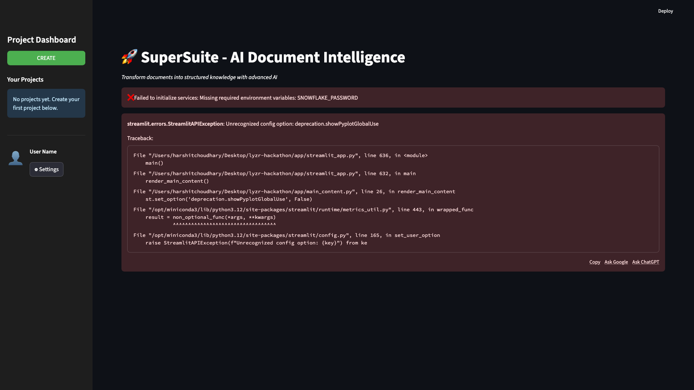

# Uploading Documents

Learn how to upload PDF documents to your SuperSuite project for AI-powered analysis.

---

## Overview

The Documents tab allows you to upload PDF files to your project. Once uploaded, documents can be processed to extract structured knowledge using AI.

**What You'll Learn:**
- How to upload single or multiple PDF files
- Understanding document status
- Viewing uploaded documents

---

## Prerequisites

Before uploading documents:
- ✅ You have created a project (see [Creating Projects](creating-projects.md))
- ✅ Your project is selected in the sidebar
- ✅ You have PDF files ready to upload

---

## Step-by-Step Guide

### Step 1: Navigate to Documents Tab

After selecting your project, you'll see four tabs in the main area:
- 📄 **Documents** (this is where we'll work)
- 🎯 Ontology
- 🧠 Knowledge Base
- 💬 Chat

The Documents tab should be selected by default.



---

### Step 2: Select Files to Upload

1. Click the **"Choose PDF files to upload"** button
2. A file browser dialog will open
3. Navigate to your PDF files
4. Select one or more PDF files
5. Click "Open" to confirm selection

**Supported Formats:**
- ✅ PDF files only
- ✅ Multiple files can be selected at once
- ✅ File size: Up to 10MB per file (recommended)


---

### Step 3: Review File Preview

After selecting files, you'll see a preview section showing:
- **Filename** - Name of each selected file
- **Size** - File size in KB or MB
- **Type** - File type (PDF)

**Example Preview:**
```
📋 File Preview
1. resume-harshit.pdf    111.2 KB    📄 PDF
2. company-report.pdf    245.8 KB    📄 PDF
```

This allows you to verify the correct files were selected before uploading.

---

### Step 4: Upload Documents

1. Review the file preview to ensure correct files are selected
2. Click the **"⬆️ Upload Documents"** button
3. Wait for the upload to complete
4. You'll see a success message: "✅ Documents uploaded successfully!"


**What Happens During Upload:**
- Files are saved to secure storage
- Document metadata is recorded
- Files are associated with your project
- Status is set to "Uploaded"

---

### Step 5: View Uploaded Documents

After uploading, scroll down to the **"Project Documents"** section.

You'll see a table with all uploaded documents:

| Filename | Size | Status | Uploaded |
|----------|------|--------|----------|
| resume-harshit.pdf | 111.2 KB | Uploaded | 2025-10-16 10:30 |
| company-report.pdf | 245.8 KB | Uploaded | 2025-10-16 10:31 |

**Document Status:**
- **Uploaded** - File uploaded, ready for processing
- **Processed** - Document has been analyzed by AI
- **Error** - Processing failed (rare)

**Metrics:**
- **Total Documents** - Count of all documents in the project

---

## Document Status Explained

### Uploaded
- ✅ File successfully uploaded to storage
- ⏳ Ready for AI processing
- 📋 Visible in documents list
- 🔄 Can be processed at any time

### Processed
- ✅ AI analysis complete
- ✅ Entities extracted
- ✅ Schema generated
- ✅ Ready for ontology creation

### Error
- ❌ Processing failed
- 🔍 Check file format and size
- 🔄 Try re-uploading the file

---

## Best Practices

### File Preparation
1. **Use Clear PDFs** - Ensure text is selectable (not scanned images)
2. **Reasonable Size** - Keep files under 10MB for best performance
3. **Descriptive Names** - Use meaningful filenames for easy identification
4. **Organize Content** - Group related documents in the same project

### Upload Tips
1. **Multiple Files** - Upload related documents together
2. **Check Preview** - Always verify files before uploading
3. **Wait for Confirmation** - Don't navigate away during upload
4. **Monitor Status** - Check document status after upload

### Common Mistakes to Avoid
- ❌ Uploading non-PDF files (not supported)
- ❌ Uploading very large files (>10MB may be slow)
- ❌ Uploading scanned images without OCR
- ❌ Navigating away during upload

---

## Troubleshooting

### Upload Button Not Working
**Problem:** Click "Upload Documents" but nothing happens

**Solutions:**
1. Ensure files are selected (preview should be visible)
2. Check file format (must be PDF)
3. Refresh the page and try again
4. Check browser console for errors

---

### File Not Appearing in List
**Problem:** Upload succeeds but file doesn't appear

**Solutions:**
1. Refresh the page (Ctrl+R or Cmd+R)
2. Check you're viewing the correct project
3. Scroll down to "Project Documents" section
4. Verify upload success message appeared

---

### Upload Takes Too Long
**Problem:** Upload is very slow or times out

**Solutions:**
1. Check file size (large files take longer)
2. Check internet connection
3. Try uploading one file at a time
4. Reduce file size if possible

---

### "No Project Selected" Message
**Problem:** Can't see upload interface

**Solutions:**
1. Create a project first (see [Creating Projects](creating-projects.md))
2. Select a project from the sidebar
3. Ensure project is highlighted in sidebar

---

## Next Steps

After uploading documents:

1. **Process Documents** → [Processing Documents](processing-documents.md)
   - Extract text and entities using AI
   - Generate schema proposals
   - Prepare for ontology creation

2. **Generate Ontology** → [Viewing Ontology](viewing-ontology.md)
   - Create knowledge structure
   - Define entity types and relationships
   - Visualize document structure

3. **Extract Knowledge** → [Exploring Knowledge](exploring-knowledge.md)
   - Browse extracted entities
   - View relationships
   - Explore knowledge graph

---

## Quick Reference

### Upload Workflow
```
1. Select Project → 2. Choose Files → 3. Review Preview → 4. Upload → 5. Verify
```

### Keyboard Shortcuts
- **Ctrl/Cmd + Click** - Select multiple files
- **Shift + Click** - Select range of files
- **Esc** - Cancel file selection dialog

### File Requirements
- **Format:** PDF only
- **Size:** Up to 10MB (recommended)
- **Content:** Text-based (not scanned images)
- **Encoding:** UTF-8 or standard PDF encoding

---

## Related Topics

- [Creating Projects](creating-projects.md) - Create a project before uploading
- [Processing Documents](processing-documents.md) - Process uploaded documents
- [Viewing Ontology](viewing-ontology.md) - Generate knowledge structure
- [Configuration](../getting-started/configuration.md) - Configure storage settings

---

## Need Help?

- 📖 [FAQ](../reference/faq.md) - Frequently asked questions
- 🔧 [Troubleshooting](../reference/troubleshooting.md) - Common issues and solutions
- 💬 [Support](../README.md#support) - Get help from the team

---

**Previous:** [Creating Projects](creating-projects.md) | **Next:** [Processing Documents](processing-documents.md)

