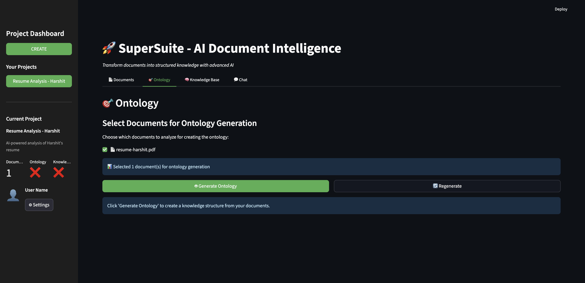

# Viewing Ontology

Learn how to generate and view the ontology (knowledge structure) created from your processed documents.

---

## Overview

The Ontology tab shows the knowledge structure extracted from your documents:
- **Entity Types** - Categories of things (Person, Organization, Concept, etc.)
- **Attributes** - Properties of each entity type
- **Relationships** - How entities connect to each other

This provides a high-level view of the knowledge contained in your documents.

---

## Prerequisites

Before viewing ontology:
- ✅ You have processed documents (see [Processing Documents](processing-documents.md))
- ✅ Documents show status "Processed"
- ✅ Your project is selected in the sidebar

---

## Step-by-Step Guide

### Step 1: Navigate to Ontology Tab

1. Ensure your project is selected in the sidebar
2. Click on the **"🎯 Ontology"** tab (second tab)
3. You'll see the ontology generation interface


---

### Step 2: Select Documents

You'll see a list of processed documents with checkboxes:

```
Choose which documents to analyze for creating the ontology:
☑ resume-harshit.pdf
☑ company-report.pdf
☑ project-proposal.pdf
```

**Selection Options:**
- ✅ Select all documents (default)
- ✅ Select specific documents only
- ✅ Must select at least one document

**Tip:** Include all related documents for a comprehensive ontology.

---

### Step 3: Generate Ontology

1. Verify documents are selected (checkboxes checked)
2. Click the **"🤖 Generate Ontology"** button
3. Wait for AI analysis to complete (10-20 seconds)
4. Watch for the spinner: "🔄 Analyzing documents with DeepSeek AI..."


**What Happens:**
- DeepSeek AI analyzes selected documents
- Identifies entity types and attributes
- Discovers relationships
- Generates ontology structure

---

### Step 4: View Entity Types

After generation, scroll down to see the **"🏗️ Entity Types"** table.

**Example Entity Types Table:**

| Entity Type | Description | Attributes | Count |
|-------------|-------------|------------|-------|
| Person | Individuals | name, role, email, phone | 5 |
| Organization | Companies | name, industry, location | 3 |
| Skill | Technical skills | name, proficiency, category | 12 |
| Education | Educational background | degree, institution, year | 2 |



**Table Columns:**
- **Entity Type** - Name of the entity category
- **Description** - What this entity represents
- **Attributes** - Properties/fields for this entity
- **Count** - Number of instances found

---

### Step 5: View Relationships

Scroll down to see the **"🔗 Relationship Types"** table.

**Example Relationships Table:**

| Relationship | Description | Count |
|--------------|-------------|-------|
| works_for | Employment relationship | 4 |
| has_skill | Person possesses skill | 12 |
| studied_at | Educational affiliation | 2 |
| located_in | Geographic location | 3 |


**Table Columns:**
- **Relationship** - Name of the relationship type
- **Description** - What this relationship means
- **Count** - Number of instances found

---

### Step 6: Review Metrics

At the bottom, you'll see summary metrics:

**Metrics Display:**
```
Entity Types: 8
Relationships: 15
Total Attributes: 42
```

**What These Mean:**
- **Entity Types** - Number of different entity categories
- **Relationships** - Number of relationship types
- **Total Attributes** - Sum of all attributes across entities

---

## Understanding the Ontology

### Entity Types Explained

**Common Entity Types:**

1. **Person** 👤
   - Individuals mentioned in documents
   - Attributes: name, role, contact info
   - Example: "Harshit Choudhary, Software Engineer"

2. **Organization** 🏢
   - Companies, institutions, groups
   - Attributes: name, industry, location
   - Example: "TechCorp, Technology, San Francisco"

3. **Concept** 💡
   - Abstract ideas, topics, themes
   - Attributes: name, description, category
   - Example: "Machine Learning, AI technique"

4. **Skill** 🎯
   - Abilities, competencies, expertise
   - Attributes: name, proficiency, category
   - Example: "Python, Expert, Programming"

5. **Education** 🎓
   - Academic qualifications
   - Attributes: degree, institution, year
   - Example: "B.Tech, MIT, 2020"

---

### Relationship Types Explained

**Common Relationships:**

1. **works_for** (Person → Organization)
   - Employment relationship
   - Example: "John works_for TechCorp"

2. **has_skill** (Person → Skill)
   - Competency relationship
   - Example: "Jane has_skill Python"

3. **studied_at** (Person → Education)
   - Educational relationship
   - Example: "Bob studied_at MIT"

4. **located_in** (Organization → Location)
   - Geographic relationship
   - Example: "TechCorp located_in San Francisco"

5. **related_to** (Any → Any)
   - Generic relationship
   - Example: "AI related_to Machine Learning"

---

## Regenerating Ontology

### When to Regenerate

Regenerate the ontology when:
- ✅ You've added new documents
- ✅ You want to change document selection
- ✅ Previous ontology seems incomplete
- ✅ You want a fresh analysis

### How to Regenerate

1. Click the **"🔄 Regenerate"** button (next to Generate Ontology)
2. Previous ontology is cleared
3. Select documents again
4. Click "Generate Ontology"
5. New ontology is created

**Warning:** Regenerating replaces the existing ontology.

---

## Best Practices

### Document Selection
1. **Include All Related Docs** - For comprehensive ontology
2. **Group Similar Content** - Documents about same topic
3. **Avoid Mixing Topics** - Keep projects focused
4. **Start Small** - Test with 1-2 documents first

### Ontology Review
1. **Check Entity Types** - Verify they make sense
2. **Review Attributes** - Ensure relevant properties captured
3. **Examine Relationships** - Confirm connections are logical
4. **Validate Counts** - Numbers should match expectations

### Quality Checks
1. **Entity Types** - Should be 3-10 types (not too many/few)
2. **Attributes** - Each type should have 2-8 attributes
3. **Relationships** - Should connect related entities
4. **Counts** - Should reflect document content

---

## Troubleshooting

### No Ontology Generated
**Problem:** Generate button clicked but nothing appears

**Solutions:**
1. Ensure documents are selected (checkboxes checked)
2. Verify documents are processed (status = "Processed")
3. Check for error messages
4. Try refreshing the page
5. Check API credentials (DeepSeek)

---

### Empty Entity Types
**Problem:** Ontology generated but no entities shown

**Solutions:**
1. Check document content (must contain structured info)
2. Verify PDFs are text-based (not scanned images)
3. Try different documents
4. Check Snowflake for data
5. Review processing logs

---

### Unexpected Entity Types
**Problem:** Entity types don't match document content

**Solutions:**
1. Review document content
2. Try regenerating ontology
3. Select different documents
4. Check if documents were processed correctly
5. Verify AI model is working properly

---

### Regenerate Button Not Working
**Problem:** Click Regenerate but ontology remains

**Solutions:**
1. Refresh the page
2. Clear browser cache
3. Try generating new ontology
4. Check browser console for errors

---

## Technical Details

### AI-Powered Generation

**DeepSeek AI:**
- Analyzes document content
- Identifies entity patterns
- Extracts attribute schemas
- Discovers relationships
- Generates ontology structure

**Data Sources:**
- Snowflake schemas table
- Snowflake nodes table
- Snowflake edges table
- Document metadata

---

### Ontology Structure

**Entity Type Schema:**
```json
{
  "name": "Person",
  "description": "Individuals",
  "attributes": ["name", "role", "email"],
  "count": 5
}
```

**Relationship Schema:**
```json
{
  "name": "works_for",
  "from_entity": "Person",
  "to_entity": "Organization",
  "description": "Employment",
  "count": 4
}
```

---

## Next Steps

After viewing ontology:

1. **Extract Knowledge** → [Exploring Knowledge](exploring-knowledge.md)
   - Browse specific entity instances
   - View entity details
   - Explore relationships

2. **Query with Chat** → [Querying with Chat](querying-chat.md)
   - Ask questions about entities
   - Get AI-powered insights
   - Explore knowledge interactively

3. **Add More Documents** → [Uploading Documents](uploading-documents.md)
   - Upload additional documents
   - Process and regenerate ontology
   - Expand knowledge base

---

## Quick Reference

### Ontology Workflow
```
1. Navigate to Ontology Tab → 2. Select Documents → 3. Generate → 4. Review Results
```

### Ontology Checklist
- [ ] Documents processed
- [ ] Ontology tab opened
- [ ] Documents selected
- [ ] Ontology generated
- [ ] Entity types reviewed
- [ ] Relationships reviewed
- [ ] Metrics checked

### Common Entity Types
- Person, Organization, Concept, Skill, Education, Location, Event, Product

### Common Relationships
- works_for, has_skill, studied_at, located_in, related_to, part_of, created_by

---

## Related Topics

- [Processing Documents](processing-documents.md) - Process documents before ontology
- [Exploring Knowledge](exploring-knowledge.md) - View extracted entities
- [Querying with Chat](querying-chat.md) - Ask questions about ontology
- [Troubleshooting](../reference/troubleshooting.md) - Resolve common issues

---

## Need Help?

- 📖 [FAQ](../reference/faq.md) - Frequently asked questions
- 🔧 [Troubleshooting](../reference/troubleshooting.md) - Common issues and solutions
- 💬 [Support](../README.md#support) - Get help from the team

---

**Previous:** [Processing Documents](processing-documents.md) | **Next:** [Exploring Knowledge](exploring-knowledge.md)

