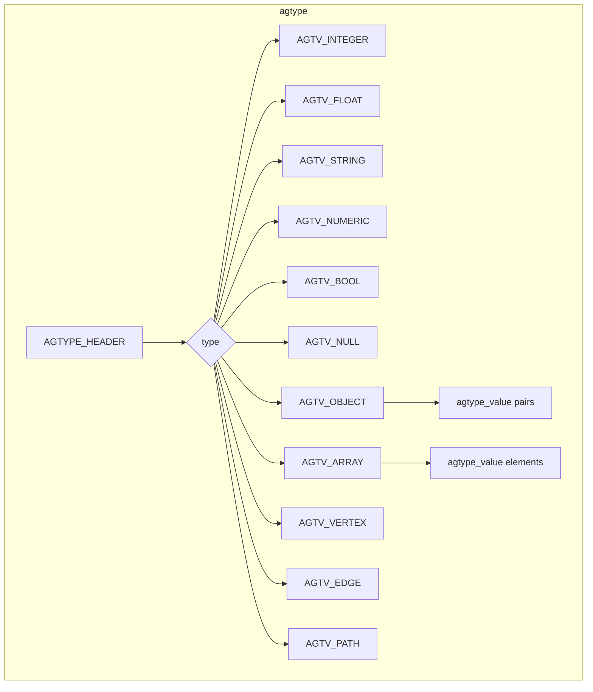

# Apache AGE Insights

## High-Level Summary

Apache AGE (A Graph Extension) is a PostgreSQL extension that provides graph database functionality. It enables users to manage and query both relational and graph data within the same PostgreSQL database. This multi-model approach allows for the use of both standard SQL and openCypher, a declarative graph query language. AGE is a powerful example of the "Framework Plugin" model, where a mature, robust database system (PostgreSQL) is extended with new capabilities.

## Low-Level Decisions and Architecture

### PostgreSQL Extension Model

AGE is not a standalone database but an extension that is loaded into a running PostgreSQL instance. This allows it to leverage PostgreSQL's mature and robust features, such as transaction management (ACID compliance), security, and backup/recovery. This architectural choice means that graph data lives alongside relational data, and both can be managed and queried within the same system.

### The `agtype` Data Type: A Deep Dive

The core of AGE's data storage is the `agtype` data type. It is a custom data type, implemented as a superset of JSON and a custom version of PostgreSQL's `jsonb` type.

#### Structure and Storage

`agtype` is designed to store not only standard JSON-like data (strings, integers, floats, booleans, nulls, objects, and arrays) but also graph-specific entities: vertices, edges, and paths.

-   **Scalar Types:** For simple data types like integers, floats, and strings, `agtype` stores them in a binary format similar to `jsonb`, which is optimized for fast access.
-   **Graph Entities:**
    -   **Vertices:** A vertex is stored as an `agtype` object with a specific structure: an `id` (graphid), a `label` (string), and a `properties` object (another `agtype` object).
    -   **Edges:** An edge is also an `agtype` object with a specific structure: an `id` (graphid), a `label` (string), a `start_id` (graphid of the start vertex), an `end_id` (graphid of the end vertex), and a `properties` object.
    -   **Paths:** A path is stored as an `agtype` array of alternating vertices and edges.

#### Serialization

The `agtype` data is serialized into a binary format for storage on disk. This binary format is highly optimized for fast parsing and retrieval. The serialization process is handled by the functions in `agtype.c`, which convert the in-memory representation of an `agtype` value into a format that can be written to disk.

#### `agtype` vs. `jsonb`

While `agtype` is based on `jsonb`, it has some key differences:

-   **Graph-Specific Types:** `agtype` has built-in support for vertices, edges, and paths, which `jsonb` does not.
-   **Type Annotations:** `agtype` supports type annotations (e.g., `::vertex`, `::edge`, `::path`) that allow the parser to correctly interpret the data.
-   **Custom Functions:** AGE provides a rich set of custom functions for creating, manipulating, and querying `agtype` data, which are not available for `jsonb`.

### Graph Schema and Table Resolution

AGE manages graph schemas and resolves table names through a combination of a dedicated catalog schema and a set of naming conventions.

#### The `ag_catalog` Schema

When you create a graph using `create_graph()`, AGE creates a set of tables and metadata in a special PostgreSQL schema called `ag_catalog`. This schema holds the definitions of all graphs, labels, and their underlying tables. Key tables in `ag_catalog` include:

-   `ag_graph`: Stores information about each graph, including its name and namespace.
-   `ag_label`: Stores information about each label, including its name, graph, and the relation (table) it maps to.

#### How Graph Namespaces Work

Each graph in AGE is associated with a PostgreSQL schema. This schema acts as a namespace for that graph's vertices and edges. When you create a vertex or edge with a specific label, AGE creates a table within that graph's namespace to store it.

#### Table Naming Conventions

AGE uses a consistent naming convention for the tables that store graph data. The table name is derived from the label name. For example, if you create a vertex with the label `Person`, AGE will create a table named `person` in the graph's schema. This allows AGE to resolve a label name to a specific table during query planning.

### Query Processing Pipeline

AGE's query processing pipeline is a fascinating example of how to integrate a new query language (Cypher) into an existing database system (PostgreSQL).

1.  **Parsing (Cypher -> AST):** When a Cypher query is executed, it is first parsed by a custom parser built with Flex and Bison (as seen in `ag_scanner.l` and `cypher_gram.y`). This parser transforms the raw query string into an Abstract Syntax Tree (AST) that represents the query's structure.

2.  **Planning (AST -> CustomScan Plan):** The AST is then passed to the PostgreSQL planner. AGE uses a hook (`set_rel_pathlist_hook`) to intercept the planning process. When it detects a Cypher-specific clause (like `CREATE`, `SET`, `DELETE`, or `MERGE`), it replaces the standard PostgreSQL plan with a `CustomScan` plan node. This custom plan node contains the information that AGE's executor will need to execute the clause.

3.  **Execution (CustomScan -> Table Operations):** Finally, the PostgreSQL executor processes the plan. When it encounters one of AGE's `CustomScan` nodes, it calls the execution functions defined by AGE (e.g., `exec_cypher_create` in `cypher_create.c`). These functions take the information from the custom plan node and perform the necessary operations on the underlying PostgreSQL tables, such as inserting new rows for vertices and edges.

### Custom Function Creation

AGE allows users to create their own custom functions (User-Defined Functions or UDFs) that can be called from within Cypher queries.

#### Registering UDFs in `ag_catalog`

To create a UDF, you use the standard PostgreSQL `CREATE FUNCTION` statement. However, to make the function available to AGE, you must create it within the `ag_catalog` schema. This registers the function with AGE and allows it to be called from Cypher queries.

#### Calling UDFs from Cypher

Once a UDF is registered in `ag_catalog`, it can be called from a Cypher query just like any other built-in function. AGE's parser and planner will resolve the function name to the correct UDF in the `ag_catalog` schema and integrate it into the query plan. The file `ag_func.c` contains helper functions that assist in this process.

## Relevance to Our Project

Apache AGE is highly relevant to our project for several reasons:

-   **Framework Plugin Model:** Our chosen approach is to build plugins/rule-sets over existing database frameworks. AGE is a perfect example of this, as it extends PostgreSQL with graph capabilities. We can learn from its design to implement our own multimodal capabilities.
-   **Hybrid Data Model:** Our project aims to support relational, graph, and vector data models. AGE's ability to handle both relational and graph data in a single database provides a valuable reference architecture.
-   **Hybrid Querying:** The ability to mix SQL and Cypher queries is a powerful feature that we should consider for our own system. It would allow users to leverage the strengths of both query languages.
-   **Single Source of Truth:** Although AGE is an extension, it maintains a single source of truth within the PostgreSQL database. This aligns with our goal of having a unified data platform.
-   **Schema Management:** We can learn from how AGE manages graph schemas and metadata within the `ag_catalog` schema. Our own system will need a robust schema management component.

## Diagrams

### `agtype` Internal Structure



### Cypher Query Lifecycle

```mermaid
graph TD
    A[Cypher Query String] -->|cypher_parser.c| B(Parser - cypher_gram.y);
    B --> C{Abstract Syntax Tree (AST)};
    C -->|cypher_paths.c| D(PostgreSQL Planner);
    D --> E{CustomScan Plan};
    E -->|cypher_create.c, etc.| F(PostgreSQL Executor);
    F --> G[Table Operations];
```

### Table Resolution for a `MATCH` clause

```mermaid
graph TD
    A[MATCH (p:Person {name: 'Alice'})] --> B{Parser};
    B --> C[AST with 'Person' label];
    C --> D{Planner};
    D -->|Looks up 'Person' in ag_catalog.ag_label| E[Finds table `graph_namespace.person`];
    E --> F[Generates Plan to Scan `graph_namespace.person`];
```