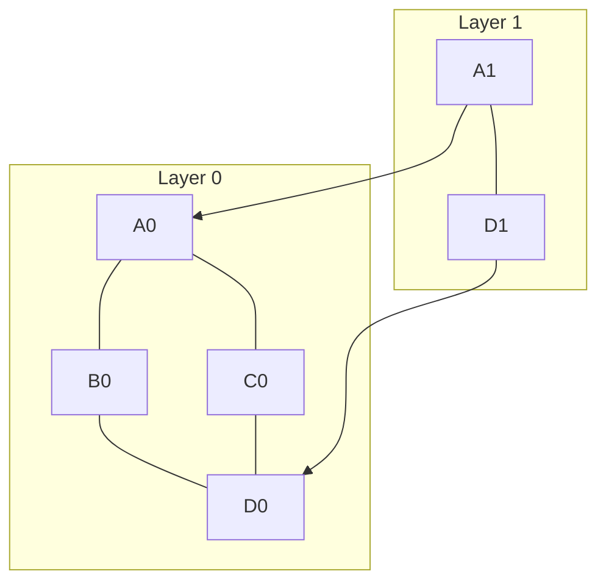
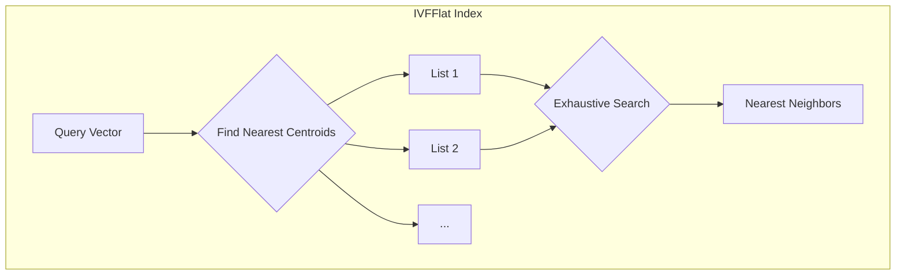
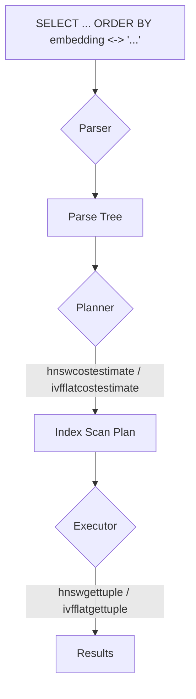

# pg-vector Insights

## High-Level Summary

pg-vector is a PostgreSQL extension that enables vector similarity search. It allows you to store vector embeddings and perform nearest neighbor searches directly within your PostgreSQL database. This is particularly useful for AI-powered applications, such as those involving natural language processing, image recognition, and recommendation systems.

## Low-Level Decisions and Architecture

### PostgreSQL Extension Model

Like Apache AGE, pg-vector is a PostgreSQL extension, not a standalone database. This allows it to integrate seamlessly with existing PostgreSQL infrastructure and leverage its features. It uses PostgreSQL's extensibility to add a new data type (`vector`), new index types (HNSW and IVFFlat), and new operators (`<->`, `<#>`, `<=>`).

### The `vector` Data Type

The core of pg-vector is the `vector` data type, which is implemented in `vector.c`.

#### On-Disk and In-Memory Representation

The `vector` data type is a simple C struct that stores the dimension of the vector and a flexible array member for the vector elements. This struct is defined in `vector.h`:

```c
typedef struct Vector
{
    int32       vl_len_;    /* varlena header */
    int16       dim;        /* dimension of vector */
    int16       unused;
    float       x[FLEXIBLE_ARRAY_MEMBER];
} Vector;
```

This structure is optimized for performance. The `vl_len_` field is the standard PostgreSQL varlena header, which stores the total length of the struct. The `dim` field stores the number of dimensions, and the `x` field is a flexible array that holds the vector elements as single-precision floating-point numbers.

#### Type Casting and Validation

`pg-vector` provides input and output functions (`vector_in` and `vector_out`) that handle the conversion between the textual representation of a vector (e.g., `[1,2,3]`) and its internal binary format. It also includes functions for casting between the `vector` type and other PostgreSQL types, such as arrays of integers or floats. The code includes robust validation to ensure that vectors have the correct dimensions and do not contain invalid values like `NaN` or `infinity`.

### Indexing Mechanisms: A Deep Dive

`pg-vector` supports two types of indexes for approximate nearest neighbor (ANN) search: HNSW and IVFFlat.

#### HNSW (Hierarchical Navigable Small World)

HNSW is a graph-based indexing algorithm that is known for its excellent performance. The implementation is found in `hnsw.c`, `hnswbuild.c`, `hnswinsert.c`, and `hnswscan.c`.

##### Graph Construction

The HNSW index is built by creating a multi-layered graph of vectors. Each vector is a node in the graph, and it is connected to its nearest neighbors. The build process, detailed in `hnswbuild.c`, happens in two phases:

1.  **In-memory phase:** The graph is built in memory for speed. If the graph fits within `maintenance_work_mem`, the entire build happens in this phase.
2.  **On-disk phase:** If the graph is too large to fit in memory, it is flushed to disk, and the build continues by inserting the remaining vectors one by one.

Parallel builds are supported to speed up the process, with a leader process coordinating multiple worker processes.

##### Search Algorithm

When a search is performed, the algorithm starts at a random entry point in the top layer of the graph and greedily traverses the graph, moving closer to the query vector at each step. When it reaches a local minimum in the top layer, it moves down to the next layer and continues the search. This process is repeated until it reaches the bottom layer, where it performs a final search to find the nearest neighbors.

#### IVFFlat (Inverted File with Flat Compression)

IVFFlat is a partitioning-based indexing algorithm. The implementation is found in `ivfflat.c`, `ivfbuild.c`, `ivfinsert.c`, and `ivfscan.c`.

##### K-Means Clustering

The IVFFlat index is built by first partitioning the vectors into a set of lists using the k-means clustering algorithm. Each list is represented by a centroid, which is the average of all the vectors in that list.

##### Search Algorithm

When a search is performed, the algorithm first finds the `probes` number of lists whose centroids are closest to the query vector. It then performs an exhaustive search within these lists to find the nearest neighbors. This approach is faster than a full brute-force search, but it can be less accurate than HNSW.

### Distance Functions and Optimization

`pg-vector` supports three main distance functions:

-   **L2 (Euclidean) distance:** Calculated using the `VectorL2SquaredDistance` function.
-   **Inner product:** Calculated using the `VectorInnerProduct` function.
-   **Cosine distance:** Calculated using the `VectorCosineSimilarity` function.

These functions are optimized for performance using techniques like auto-vectorization, which allows the compiler to generate code that can process multiple vector elements at once.

### Query Execution Flow

When a query with a vector similarity search is executed, the following steps occur:

1.  **Parsing:** The PostgreSQL parser recognizes the vector operators (`<->`, `<#>`, `<=>`) and creates a parse tree.
2.  **Planning:** The PostgreSQL planner uses the `ivfflatcostestimate` or `hnswcostestimate` function to determine the cost of using the index. If the cost is lower than a sequential scan, it generates a plan that uses the index.
3.  **Execution:** The PostgreSQL executor calls the appropriate index scan function (`ivfflatgettuple` or `hnswgettuple`) to retrieve the nearest neighbors from the index. These functions then use the distance functions to calculate the distance between the query vector and the vectors in the index.

## Relevance to Our Project

pg-vector is highly relevant to our project, especially for the vector database component of our multimodal architecture.

-   **Framework Plugin Model:** pg-vector is another excellent example of the "Framework Plugins" approach we've chosen. It demonstrates how to add specialized functionality (vector search) to a general-purpose database (PostgreSQL).
-   **Hybrid Data Model:** Our project needs to handle vector data alongside relational and graph data. pg-vector shows how to integrate vector storage and querying into a relational database.
-   **Complete Content Vectorization:** Our data model specifies that the entire content of a data entity (both structured and unstructured) should be vectorized. pg-vector provides the underlying infrastructure to store and query these vectors.
-   **Unified Data Platform:** By using pg-vector, we can keep our vector data within our primary data platform (which will be based on a relational model), reinforcing our goal of a single source of truth.
-   **Performance and Scalability:** pg-vector's support for both exact and approximate search, along with its different index types, provides the flexibility to tune performance based on specific use cases. We can learn from its indexing strategies to optimize our own system.

## Diagrams

### HNSW Graph Structure



### IVFFlat Partitioning



### pg-vector Query Flow

